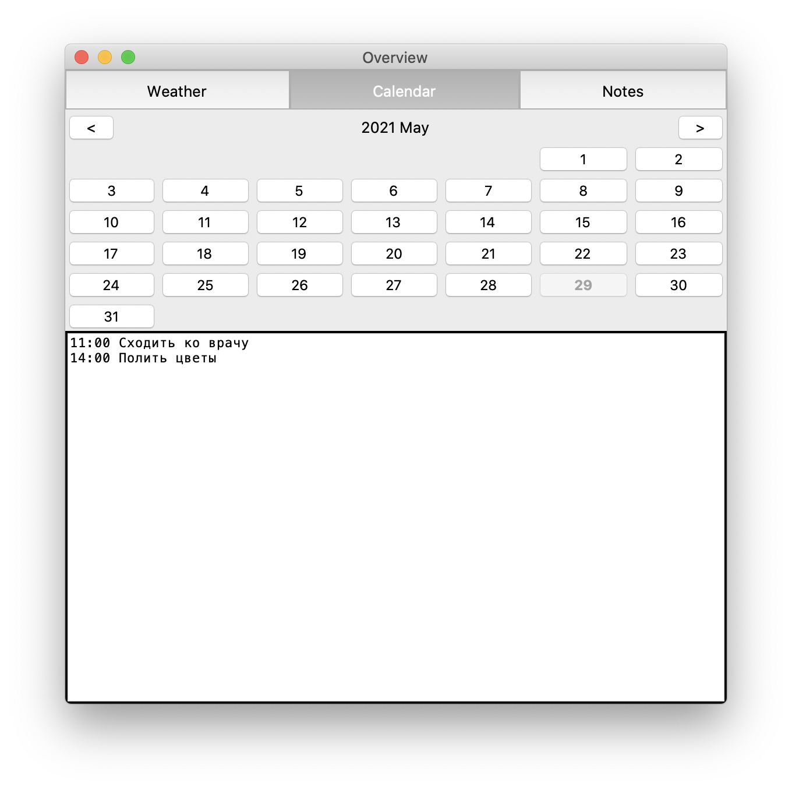

## Календарь

В данной вкладке можно просматривать календарь и добавлять записи по каждому дню. Создаваемая в данной вкладке запись будет сохранена на диске как заметка, заголовок которой - день, к которому она привязана. Её также можно будет посмотреть и изменить во вкладке с заметками.

В верхней части вкладке соджержится информация о текущем выбранном месяце и годе. При открытии вкладки всегда отображается текущий месяц и год. 

Дни, для которых уже существуют непустые записи, выделены жирным шрифтом. Для текущего выбранного дня соответствующая ему кнопка недоступна для нажатия, а её текст имеет серый цвет. При открытии вкладки всегда выбран текущий день. 

В нижней половине вкладки содержится текстовое поле, в котором можно набрать текст записи, которая будет сохранена с привязкой к выбранному дню. Сохранение записи происходит автоматически при перемещении курсора из текстового поля. Для удаления записи достаточно удалить текст записи - пустые записи удаляются автоматически.