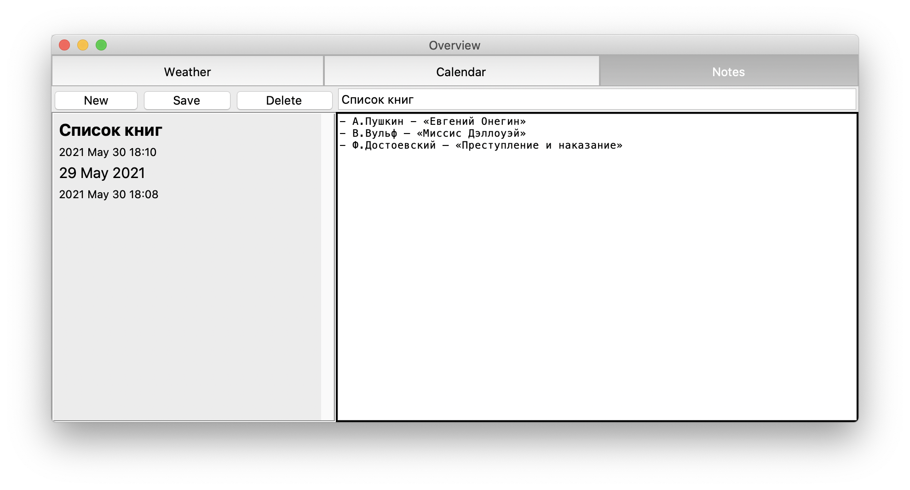
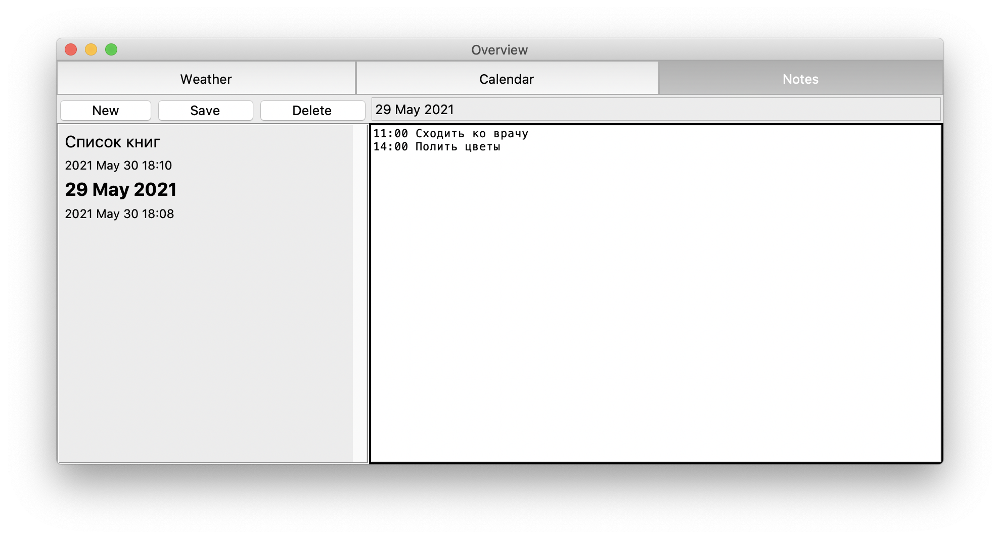

# Заметки

Вкладка с заметками позволяет создавать заметки, а также просматривать, редактировать и удалять заметки, созданные в данной вкладке и во вкладке календаря. При этом для заметок, полученных из записей календаря, недоступно редактирование заголовка.

В левой части вкладки содержится список существующих заметок с их заголовками и датами последних изменений. Список заметок отсортирован по дате последних изменений. Текущая выбранная заметка выделена более крупным шрифтом у заголовка.

Для управления заметками есть 3 кнопки - "Создать", "Сохранить", "Удалить". Кнопка "Создать" создает новую безымянную заметку с пустым текстом и сохраняет её на диск. Кнопка "Сохранить" позволить сохранить заметку вручную, однако в приложении реализовано автосохранение. Кнопка "Удалить" удаляет текущую выбранную заметку.

В правой части вкладки содержатся поля для редактирования заголовка и тела заметки. Заголовок не может содержать переносов строк. Заголовок не может быть изменен в случае, если заметка была создана как запись в календаре.
